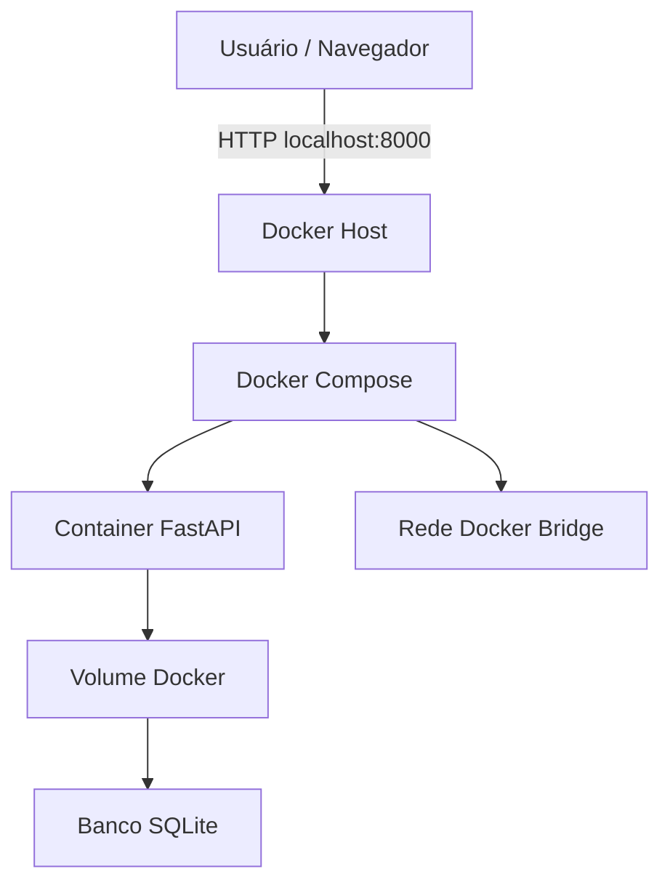
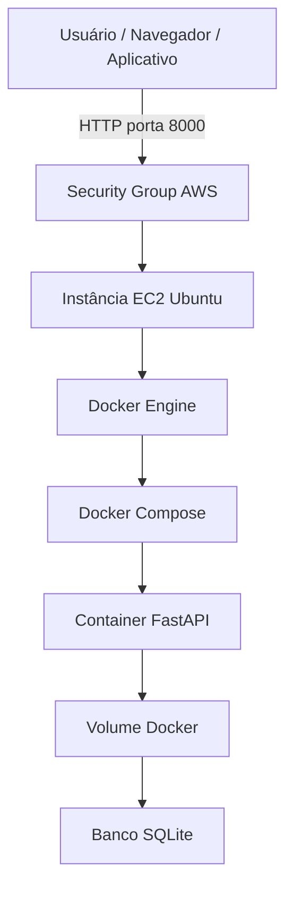

# Arquitetura da ServiceDesk Cloud API

## Visão geral

A ServiceDesk Cloud API é uma aplicação REST desenvolvida em Python com FastAPI, containerizada com Docker e preparada para execução em ambiente de nuvem utilizando AWS EC2.

O objetivo da arquitetura é demonstrar, de forma prática, os conceitos de containers, rede, porta, volume persistente, deploy em nuvem e modelo de serviço IaaS.

## Modelo de serviço em nuvem

O modelo escolhido para a primeira versão do projeto é o IaaS, utilizando uma instância EC2 da AWS.

No modelo IaaS, a provedora de nuvem fornece a infraestrutura base, como servidores virtuais, rede, armazenamento e recursos computacionais. O usuário fica responsável por configurar o sistema operacional, instalar dependências, configurar Docker, expor portas, gerenciar segurança e realizar o deploy da aplicação.

Essa escolha foi feita porque oferece maior controle e aprendizado sobre os fundamentos de computação em nuvem.

## Diagrama da arquitetura local com Docker



## Diagrama da arquitetura em nuvem AWS



## Componentes da arquitetura

| Componente          | Função                                                     |
| ------------------- | ---------------------------------------------------------- |
| Usuário / Navegador | Acessa a API e a documentação interativa                   |
| FastAPI             | Framework responsável pela criação da API REST             |
| Uvicorn             | Servidor ASGI que executa a aplicação Python               |
| Docker              | Plataforma de containerização da aplicação                 |
| Docker Compose      | Ferramenta para configurar container, porta, rede e volume |
| SQLite              | Banco de dados utilizado na primeira versão                |
| Volume Docker       | Responsável por manter os dados persistentes               |
| Rede Docker Bridge  | Rede isolada criada para a aplicação                       |
| AWS EC2             | Máquina virtual usada para hospedar a aplicação na nuvem   |
| Security Group      | Firewall da AWS usado para controlar portas liberadas      |

## Fluxo de funcionamento

1. O usuário acessa a aplicação pelo navegador ou por outro sistema.
2. A requisição HTTP chega à porta 8000.
3. O Docker redireciona a requisição para o container da aplicação.
4. O Uvicorn executa a aplicação FastAPI.
5. A API processa a solicitação.
6. Quando há operação de dados, a API acessa o banco SQLite.
7. O banco SQLite fica armazenado em um volume Docker persistente.
8. A resposta é devolvida ao usuário em formato JSON.

## Porta

A aplicação utiliza a porta 8000.

No Docker Compose, a porta 8000 do container é exposta para a porta 8000 da máquina local:

```text
localhost:8000 -> container:8000
```

## Rede

O projeto utiliza uma rede Docker própria chamada:

```text
servicedesk_network
```

Essa rede permite isolar a comunicação da aplicação e simular uma configuração mais próxima de ambientes profissionais.

## Volume persistente

O projeto utiliza um volume Docker chamado:

```text
servicedesk_data
```

Esse volume armazena o banco SQLite da aplicação. Dessa forma, mesmo que o container seja parado ou recriado, os dados continuam preservados.

## Segurança

A arquitetura considera as seguintes práticas de segurança:

* Execução do container com usuário não-root.
* Uso de arquivo `.env.example` para evitar exposição de variáveis sensíveis.
* Exposição apenas da porta necessária.
* Uso de Security Group na AWS.
* SSH restrito ao IP do desenvolvedor.
* Não armazenamento de senhas no código.
* Separação entre aplicação e dados por meio de volume Docker.

## Escalabilidade e elasticidade

Na primeira versão, a aplicação roda em uma única instância EC2. Essa abordagem é suficiente para aprendizado e para uma aplicação simples.

Como evolução futura, a arquitetura poderia ser modificada para usar:

* AWS App Runner;
* Amazon ECS;
* AWS Fargate;
* Load Balancer;
* Amazon RDS;
* Auto Scaling;
* CI/CD com GitHub Actions.

Com essas melhorias, a aplicação poderia escalar de forma mais automatizada e se aproximar de um ambiente de produção.

## Responsabilidade compartilhada

No modelo IaaS, a AWS é responsável pela infraestrutura física, datacenters, rede global e virtualização. O usuário é responsável pela configuração do sistema operacional, instalação do Docker, segurança da aplicação, atualizações, gerenciamento de portas, dados e controle de acesso.

Por isso, o projeto considera boas práticas como restrição de portas, uso de usuário não-root no container e atenção à configuração dos grupos de segurança.
